# Voice OTP — Dossier final du projet

Document de synthèse A → Z : ce qui a été construit, comment le système est architecturé, et comment il travaille **à l’intérieur** (OTP, canaux, admin, IA).

---

## 1. Objectif

**Voice OTP** est une plateforme d’authentification à deux facteurs. L’utilisateur reçoit un code à 6 chiffres (OTP) par **appel vocal**, **SMS** ou **e-mail**, puis le saisit pour valider son identité.

Autour de ce cœur, le projet ajoute :

- une **application utilisateur** (React) pour le parcours de connexion ;
- une **console d’administration** (Nuxt 3) pour les statistiques, journaux et outils ;
- un **AI Control Center** indépendant : analyses, anomalies, prédictions, copilote et guide vocal.

Principe fondamental : **l’IA ne génère jamais d’OTP**, ne voit jamais le code en clair, ni les numéros / e-mails complets. Elle ne lit que des **agrégats** (compteurs, taux, scores).

---

## 2. Ce qui a été livré (A → Z)

| Étape | Livrable | Rôle |
|---|---|---|
| A | Cœur Flask (`backend/`) | API unique : auth, admin, IA |
| B | Génération OTP sécurisée | Code 6 chiffres, hash HMAC, TTL 180 s, usage unique |
| C | Canal **voix** | Asterisk ARI + Linphone `1000` + TTS Windows |
| D | Canal **e-mail** | SMTP Gmail (mot de passe d’application) |
| E | Canal **SMS** | EasySend (API réelle) |
| F | Redis | Stockage temporaire des OTP + compteurs d’essais |
| G | SQLite `otp_history.db` | Historique masqué pour le dashboard |
| H | App React | Parcours utilisateur 4 étapes |
| I | API admin | KPI, graphiques, journaux, outils Redis |
| J | Dashboard Nuxt | Accueil, journaux, outils, AI Control Center |
| K | Couche IA | IsolationForest, prédictions, Ollama `llama3.2:3b`, copilote |
| L | Guide vocal | Scripts FR + TTS (navigateur ou WAV SAPI) |

---

## 3. Architecture globale

Le système est un **hub Flask** (`http://127.0.0.1:5000`) autour duquel gravitent trois clients et plusieurs services externes.

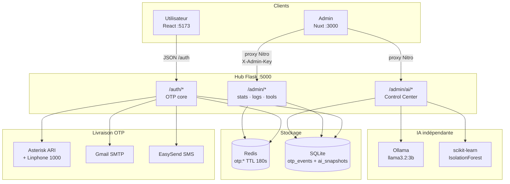

**Ports locaux**

| Service | URL | Rôle |
|---|---|---|
| Flask | `http://127.0.0.1:5000` | API unique |
| React (Vite) | `http://localhost:5173` | App utilisateur |
| Nuxt | `http://localhost:3000` | Console admin |
| Redis | `localhost:6379` | OTP live |
| Ollama | `http://127.0.0.1:11434` | LLM local |
| Asterisk ARI | `http://localhost:8088/ari` | Origine des appels vocaux |
| SIP Linphone | UDP `5060` | Téléphone virtuel extension `1000` |

---

## 4. Structure des dossiers

```text
d:\voice-otpbackendotp\
├── final.md                          ← ce document
├── voice-otp\
│   ├── api.md                        ← contrat API (front / admin)
│   ├── README.md                     ← lancement rapide
│   ├── asterisk-config\              ← pjsip, extensions, ARI, RTP
│   ├── asterisk-sounds\              ← WAV 8 kHz pour Asterisk
│   ├── backend\
│   │   ├── app.py                    ← point d’entrée Flask
│   │   ├── db.py                     ← SQLite + agrégats dashboard
│   │   ├── admin_config.py           ← clé X-Admin-Key
│   │   ├── smtp_config.py / sms_config.py
│   │   ├── otp\                      ← generate, store, verify, TTS
│   │   ├── channels\                 ← email, sms, phone, pays
│   │   ├── pbx\client.py             ← Asterisk ARI
│   │   ├── routes\                   ← auth, admin, ai
│   │   └── ai\                       ← Control Center (indépendant)
│   └── frontend\                     ← React + Vite
└── dashbord-admin\                   ← Nuxt 3 (hors voice-otp/)
    ├── pages\                        ← /, /logs, /ai, /tools
    ├── server\api\admin\[...path].ts ← proxy qui injecte la clé
    └── composables\useAdminApi.ts
```

Le dashboard Nuxt est **volontairement séparé** du backend OTP. Il ne parle à Flask que via un **proxy serveur** : la clé admin n’est jamais dans le bundle navigateur.

---

## 5. Stack technique

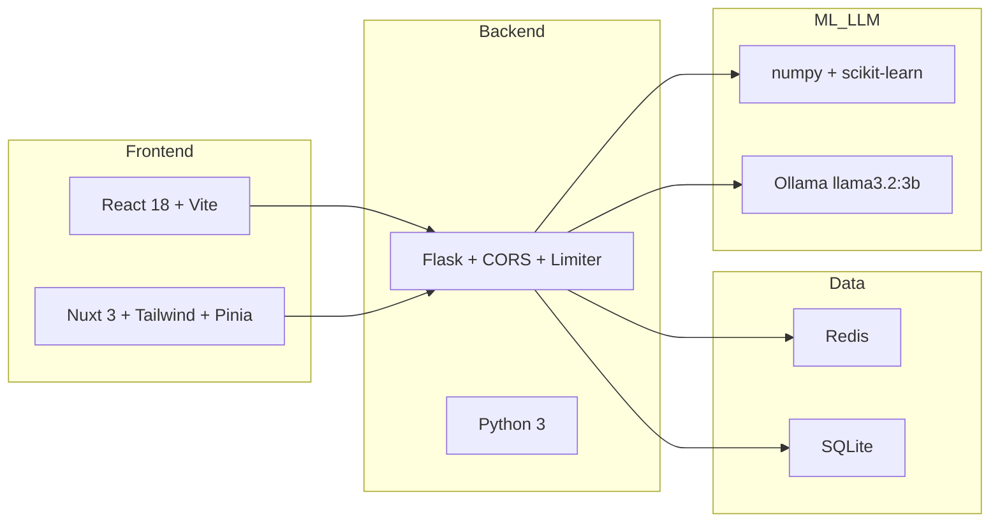

| Couche | Technologie |
|---|---|
| API | Flask, flask-cors, flask-limiter |
| OTP live | Redis (`otp:{userId}`, `attempts:{userId}`) |
| Historique | SQLite `otp_history.db` |
| Voix | Asterisk PJSIP + ARI, Linphone, Windows SAPI TTS |
| E-mail | SMTP Gmail STARTTLS |
| SMS | EasySend HTTP API |
| ML | IsolationForest, régression linéaire (sklearn) |
| LLM | Ollama `/api/generate`, modèle `llama3.2:3b` |
| Admin UI | Nuxt 3, Tailwind, graphiques maison |
| User UI | React Router, Lucide |

---

## 6. Parcours utilisateur (app React)

L’app ne stocke **pas** le code OTP. Elle envoie `userId` + canal, puis demande à l’utilisateur de taper le code reçu.

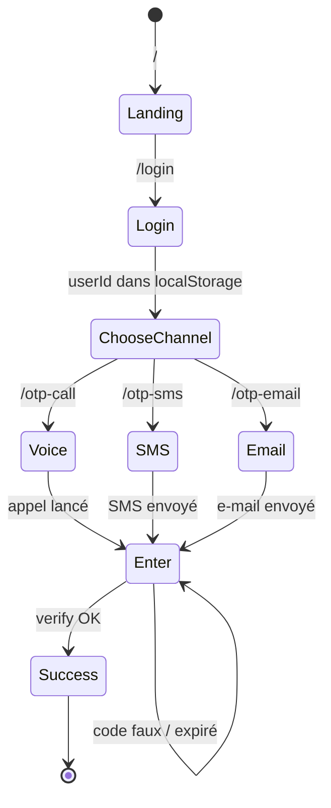

Étapes à l’écran :

1. **Landing** — présentation.
2. **Login** — saisie `userId` (pas de mot de passe applicatif : le 2FA *est* l’auth).
3. **Choix du canal** — voix / SMS / e-mail.
4. **Envoi** — appel Linphone, formulaire SMS (indicatif + numéro), ou e-mail.
5. **Saisie** — 6 chiffres, `POST /auth/verify-otp`.
6. **Succès**.

Le proxy Vite redirige `/auth` vers Flask, donc le front appelle `/auth/...` sans CORS côté navigateur.

---

## 7. Comment l’OTP travaille à l’intérieur

### 7.1 Cycle de vie d’un code

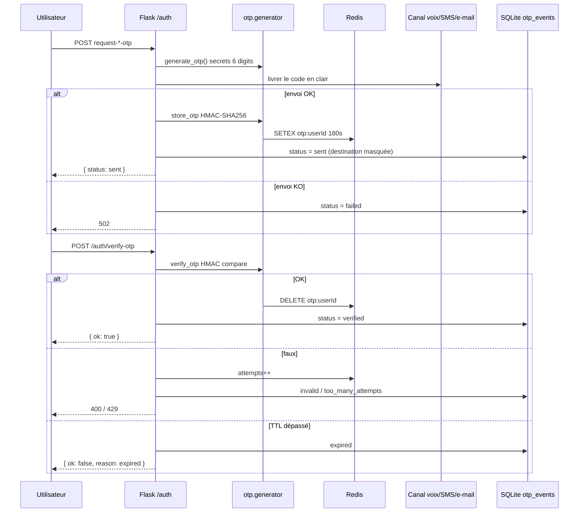

### 7.2 Génération

- `secrets.choice("0123456789")` × 6 — cryptographiquement aléatoire, pas `random`.
- Le code **n’est jamais écrit** dans SQLite ni renvoyé au dashboard.

### 7.3 Stockage (jamais en clair)

Redis (ou dictionnaire mémoire si Redis est down) :

```text
clé     : otp:{userId}
TTL     : 180 secondes
valeur  : {hmac_sha256(secret, userId:otp)}|{nb_essais}|{expires_at}
```

Vérification : `hmac.compare_digest` (anti timing-attack).  
Si le code est bon → la clé est **supprimée** (usage unique).

### 7.4 Vérification et verrous

| Règle | Valeur |
|---|---|
| Durée de vie | 180 s |
| Mauvais codes (couche route) | 3 puis HTTP 429 `too_many_attempts` |
| Mauvais codes (payload Redis) | 5 puis `locked` |
| Demandes par IP | 3 / 5 minutes (`flask-limiter`) |
| Anti-spam canal SMS/e-mail | intervalle min. + fenêtre |

Après 3 échecs, le code est **détruit** : l’utilisateur doit en demander un nouveau.

### 7.5 Historique (ce que l’admin voit)

Table SQLite `otp_events` :

| Colonne | Contenu |
|---|---|
| `timestamp` | UTC ISO |
| `user_id` | identifiant |
| `channel` | `voice` / `sms` / `email` |
| `destination` | **déjà masquée** (`joh***@gmail.com`, `+222 43***54`, `ext 1000`) |
| `status` | `sent`, `failed`, `verified`, `invalid`, `expired`, `too_many_attempts` |
| `source_ip` | IP du client |

Les destinations sont masquées **à l’insertion**, pas seulement à l’affichage.

---

## 8. Les trois canaux de livraison

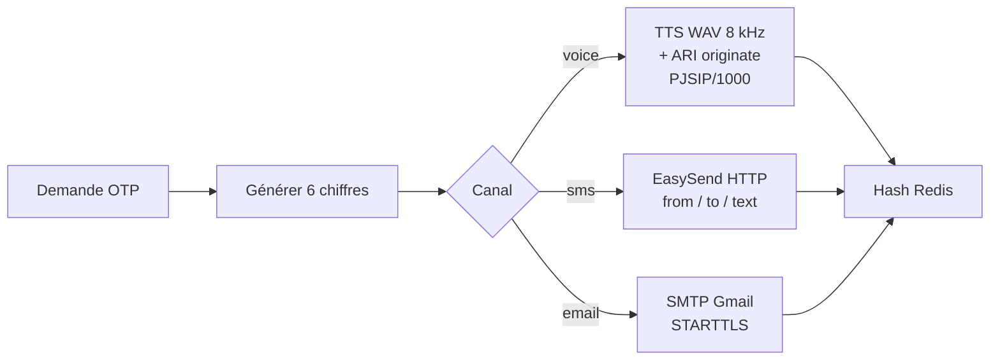

### 8.1 Voix (cœur du projet)

Flux interne d’un appel :

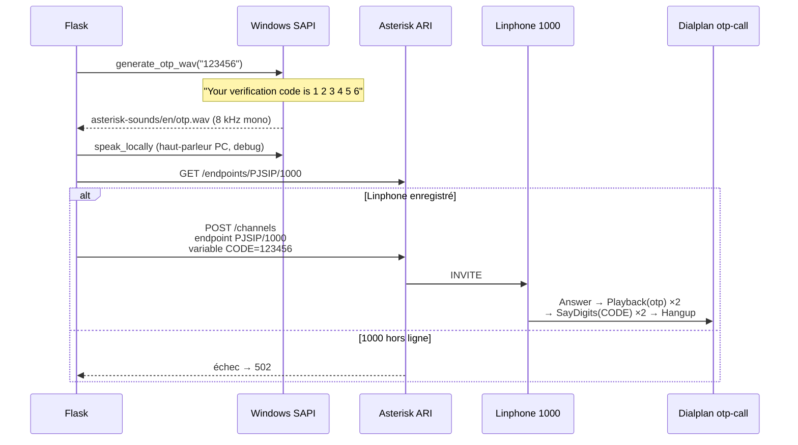

Dialplan (`asterisk-config/extensions.conf`, contexte `otp-call`) :

1. `Answer`
2. Bip d’attention
3. Lecture du fichier `otp.wav` (deux fois)
4. `SayDigits(${CODE})` (deux fois)
5. `Hangup`

Le WAV est converti en **8 kHz, 16-bit, mono** (format attendu par Asterisk).  
L’extension SIP `1000` est le téléphone de test (Linphone).

### 8.2 E-mail

`deliver_email` → SMTP `smtp.gmail.com` + STARTTLS + mot de passe d’**application** Gmail.  
Sujet : « Votre code de vérification ». Corps : code + expiration 3 minutes.

Route dédiée : `POST /auth/request-email-otp` `{ userId, email }`.

### 8.3 SMS

`deliver_sms` → EasySend (`apikey` + JSON `from` / `to` / `text`).  
Le numéro est normalisé (chiffres, strip `00` / `+`).  
Route dédiée : `POST /auth/request-sms-otp` `{ userId, phoneNumber }`.

---

## 9. Flask : organisation interne

Au démarrage (`app.py`) :

1. CORS (headers `Content-Type`, `X-Admin-Key`)
2. Rate limiter
3. `init_db()` SQLite
4. Blueprints : `auth`, `auth_extra`, `admin`, `ai`
5. Thread daemon **AI worker** (refresh toutes les 5 minutes)

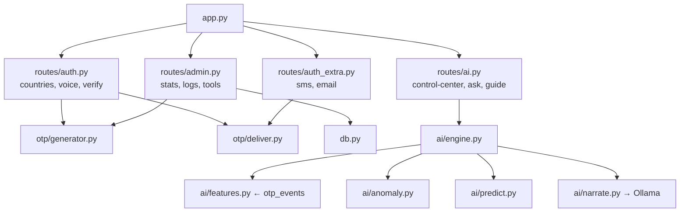

---

## 10. Console d’administration (Nuxt)

### 10.1 Pourquoi un proxy

La clé `X-Admin-Key` ne doit **pas** partir dans le JavaScript public.

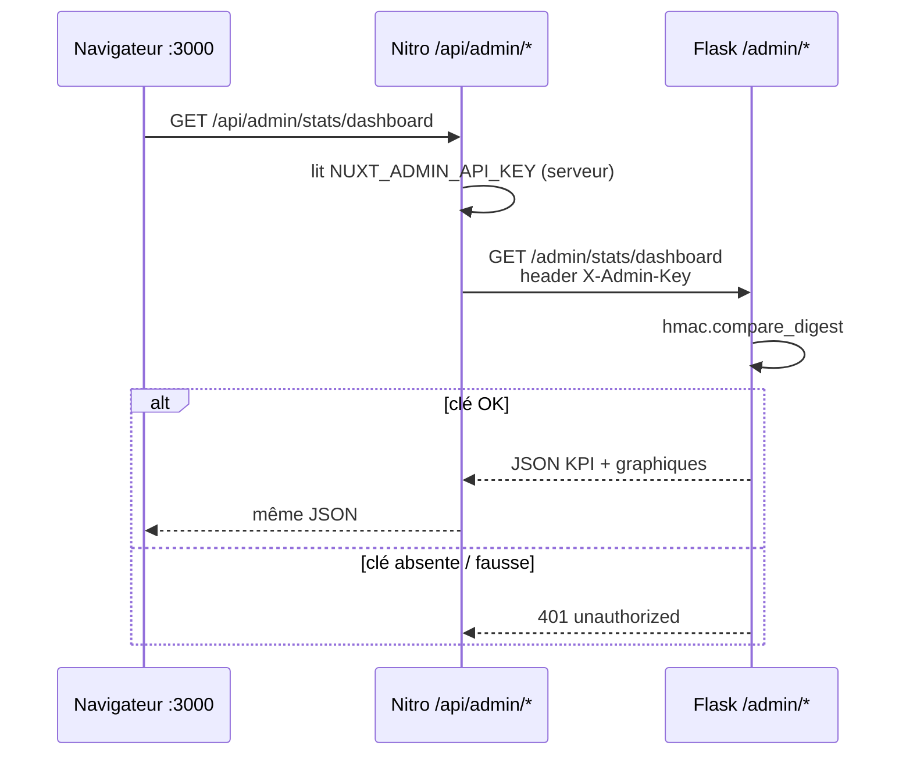

Comparaison de la clé : hash SHA-256 puis `hmac.compare_digest` (pas de fuite par timing).

### 10.2 Pages

| Route | Page | Données |
|---|---|---|
| `/` | Tableau de bord | `GET /admin/stats/dashboard` — KPI, sparkline 24 h, tendance 7 j, donut canaux, funnel, heatmap, top users |
| `/logs` | Journaux | `GET /admin/logs` — filtres canal / statut / dates + pagination |
| `/ai` | AI Control Center | `GET /admin/ai/control-center` + copilote `POST /admin/ai/ask` |
| `/tools` | Outils | Redis status, flush OTP, test OTP, cleanup > 30 jours |

Bouton **Écouter** (header) : guide vocal français (`SpeechSynthesis` `fr-FR`).

### 10.3 Agrégats dashboard (côté `db.py`)

Tout est calculé depuis `otp_events`, **sans jamais relire un OTP** :

- KPI 24 h / 7 j (taux de succès = `verified / total`)
- série temporelle jour ou heure
- mix canaux et statuts
- funnel : envoyés → vérifiés → invalides → expirés → bloqués → échecs d’envoi
- heatmap 7 × 24 (jour de semaine × heure)
- top utilisateurs
- codes encore vivants dans Redis (`active_codes`)

---

## 11. AI Control Center — couche indépendante

Cette couche **ne touche pas** `generate_otp` / `verify_otp` / la livraison voix.

Elle lit uniquement `otp_events` (agrégats) + un snapshot JSON en cache.

### 11.1 Pipeline

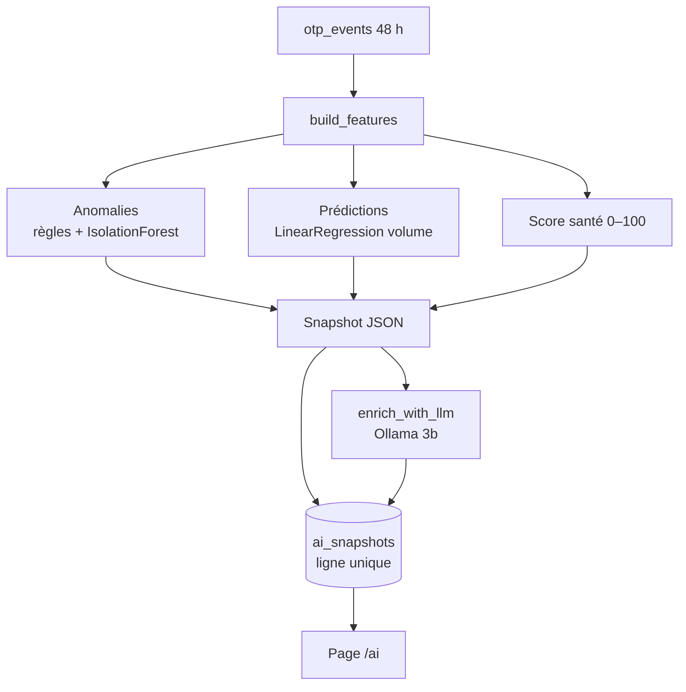

Worker (`ai/jobs.py`) :

1. Au boot : calcule un snapshot **métriques** (rapide).
2. Toutes les **300 s** : `compute_control_center()` puis `enrich_with_llm()`.
3. `POST /admin/ai/refresh` force le même cycle (bouton **Actualiser**).

Si Ollama est down → provider `template` : textes déterministes à partir des chiffres, jamais d’invention.

### 11.2 Features (ce que le ML voit)

Par heure et par canal, sur 24–48 h :

- nombre de requêtes
- taux de succès / échec
- `too_many_attempts`
- fiabilité (dérivée des taux)

`insufficient` n’est **vrai que s’il n’y a 0 événement / 24 h**. Un canal sans trafic n’efface pas tout le dashboard.

### 11.3 Anomalies

1. **Règles métier** : hausse d’échecs 6 h, trop de `too_many_attempts` (≥ 8 %), pic de volume.
2. **IsolationForest** si ≥ 3 heures actives (vecteur : requêtes, failure_rate, success_rate, blocked, failed+invalid).
3. Sinon **z-score** sur le taux d’échec.

Score 0–1 → risque LOW / MEDIUM / HIGH.  
Le score santé part de 100 et est pénalisé par échecs, blocages et anomalie.

### 11.4 LLM (Ollama)

| Paramètre | Valeur |
|---|---|
| API | `POST http://127.0.0.1:11434/api/generate` |
| Modèle | `llama3.2:3b` |
| Tokens max | 512 |
| Timeout dashboard | 60 s |
| Timeout copilote | 30 s |
| Température | 0.2 |

Le prompt ne reçoit **que** des faits agrégés (taux, volumes, raisons d’anomalie).  
Consigne : français, phrases complètes, **aucun chiffre inventé**.

Copilote `POST /admin/ai/ask` : même garde-fou. Si le modèle échoue, réponses gabarit (`template`).

### 11.5 Guide vocal

`GET /admin/ai/guide?section=...` renvoie un script français (sidebar, accueil, IA, outils…).  
Audio optionnel : WAV Windows SAPI. Le header Nuxt utilise plutôt `speechSynthesis` pour une lecture immédiate.

---

## 12. Sécurité — vue d’ensemble

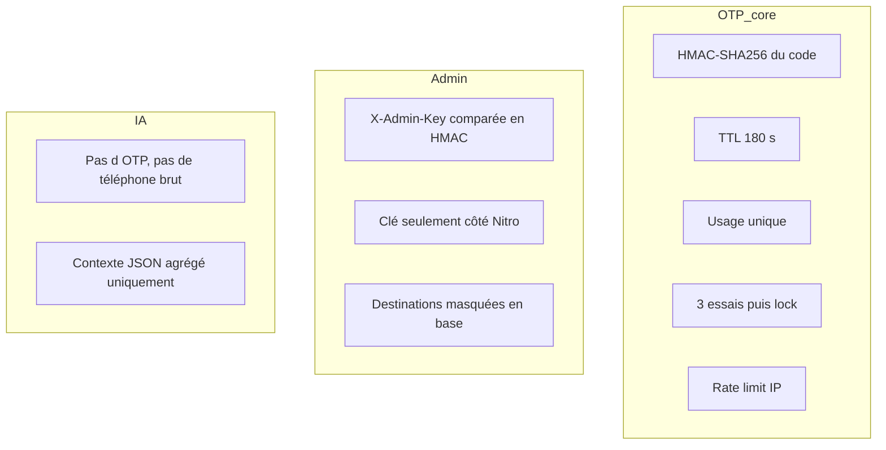

Points clés :

- OTP jamais loggé dans l’historique admin.
- Destinations masquées **à l’écriture** SQLite.
- Clé admin hors du navigateur.
- IA isolée du générateur OTP.
- Fallback Redis → mémoire processus si Redis est down (dev).
- CORS limité aux headers utiles.

---

## 13. Cartographie des API (rappel)

### Utilisateur (`/auth`)

| Méthode | Chemin | Action |
|---|---|---|
| GET | `/auth/countries` | Indicatifs SMS |
| POST | `/auth/request-voice-otp` | Appel Linphone 1000 |
| POST | `/auth/request-sms-otp` | SMS EasySend |
| POST | `/auth/request-email-otp` | E-mail Gmail |
| POST | `/auth/verify-otp` | Vérifier le code |

### Admin (`X-Admin-Key`)

| Méthode | Chemin | Action |
|---|---|---|
| GET | `/admin/stats/dashboard` | Tout l’accueil en un appel |
| GET | `/admin/logs` | Journaux filtrés |
| GET | `/admin/tools/redis-status` | OTP live |
| POST | `/admin/tools/flush-redis` | Invalider les codes actifs |
| POST | `/admin/tools/test-otp` | Envoi test `userId=admin-test` |
| POST | `/admin/tools/cleanup` | Purge SQLite > 30 jours |

### IA

| Méthode | Chemin | Action |
|---|---|---|
| GET | `/admin/ai/control-center` | Snapshot page `/ai` |
| POST | `/admin/ai/refresh` | Recalcul + LLM |
| POST | `/admin/ai/ask` | Copilote |
| GET | `/admin/ai/guide` | Scripts vocaux |
| GET | `/admin/ai/health` … | Sous-ressources du même snapshot |

Détail des JSON : `voice-otp/api.md`.

---

## 14. Comment tout s’enchaîne en production locale

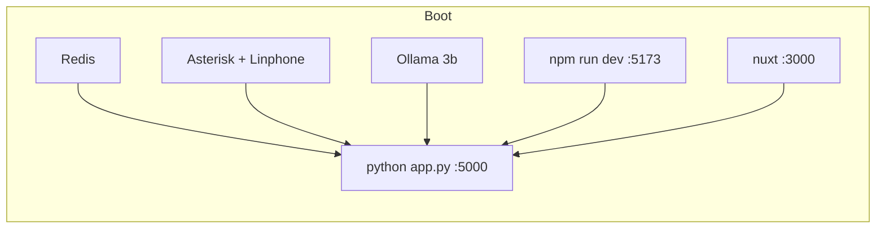

1. Redis + Asterisk (Linphone enregistré en `1000`) + Ollama.
2. `cd voice-otp/backend` → `python app.py`.
3. `cd voice-otp/frontend` → `npm run dev` → `http://localhost:5173`.
4. `cd dashbord-admin` → `.env` avec `NUXT_API_BASE` + `NUXT_ADMIN_API_KEY` → `npm run dev` → `http://localhost:3000`.
5. Demander un OTP depuis React → voir l’événement dans **Journaux** → **Actualiser** sur `/ai` pour l’analyse LLM.

---

## 15. Décisions d’architecture (pourquoi c’est ainsi)

| Décision | Raison |
|---|---|
| Un seul backend Flask | Un contrat API, trois clients (React, Nuxt, tests PowerShell) |
| Redis pour l’OTP, SQLite pour l’historique | Live court vs analytique long, sans mélanger secret et stats |
| Hash HMAC, pas le code en clair | Fuite Redis ≠ fuite OTP |
| Masquage à l’INSERT | Un dump SQLite ne révèle pas les destinataires |
| IA dans `backend/ai/` séparé | On peut casser / enrichir l’IA sans toucher generate/verify/voix |
| Snapshot + worker 5 min | La page `/ai` reste rapide ; le LLM tourne en arrière-plan |
| Proxy Nitro | La clé admin n’est pas dans le JS public |
| Ollama local | Pas de cloud, pas d’envoi de métriques hors machine |
| IsolationForest + règles | ML dès 3 heures de trafic ; règles métier même sans sklearn |
| Template fallback | Dashboard utilisable si Ollama est arrêté |

---

## 16. Limites actuelles (honnêtes)

- Voix de démo = **un** poste Linphone (`1000`), pas un numéro RTC public.
- TTS voix = anglais SAPI pour Asterisk ; le guide admin est en français.
- Prédiction canal = surtout le taux d’échec courant + tendance de volume (pas un modèle profond).
- Score santé = heuristique pondérée, pas un SLA contractuel.
- Clés / mots de passe d’appli sont dans des fichiers de config locaux (à remplacer par variables d’environnement en prod).
- `app.py` contient un double enregistrement du handler 429 / `if __name__` (cosmétiques, sans impact métier).

---

## 17. Schéma de données

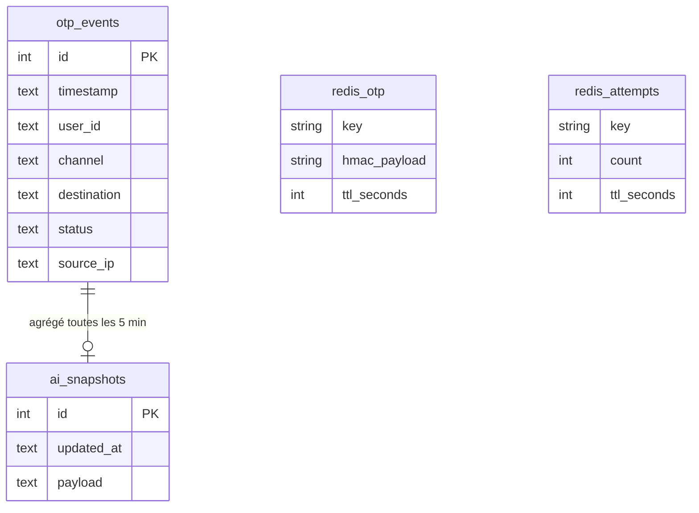

Redis n’est pas une table SQL : il est représenté ici pour montrer le **duo** live (codes) / historique (événements).

---

## 18. En une phrase

Un utilisateur demande un code ; Flask le **génère**, le **livre** (voix Asterisk, SMS ou e-mail), le **stocke hashé 3 minutes** dans Redis, et **journalise un événement masqué** dans SQLite. L’admin Nuxt lit ces événements pour les graphiques. Une couche IA séparée en déduit santé, anomalies et un texte français via Ollama, **sans jamais toucher au code OTP**.
